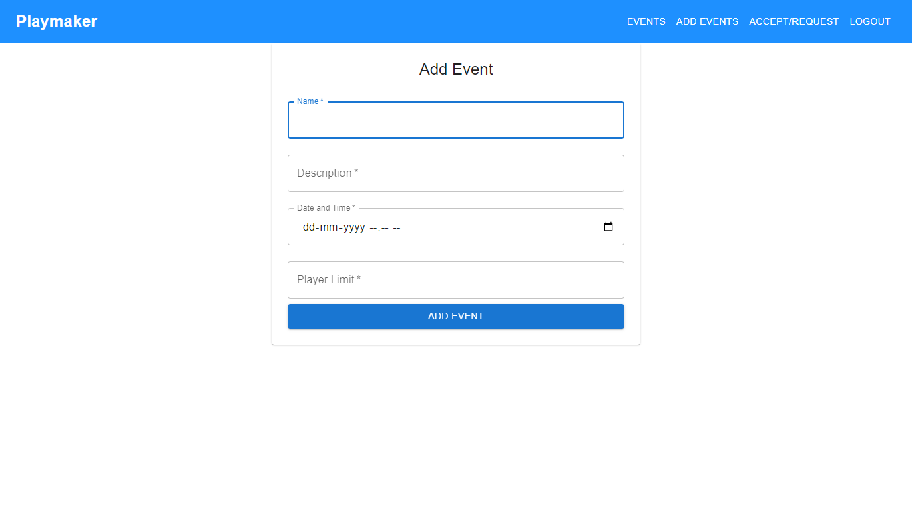

# Playmaker

### Introduction

Our app is a platform for sports enthusiasts to find and join sports events near them. With our app, users can browse a list of available events, view details about each event, and join the events they are interested in. The app allows users to create their own events and set a limit on the number of players, as well as view the list of players who have joined the event. It is simple for users to find and join the events they are interested in. Whether you are looking to join a pickup football game or a local badminton tournament.

### Tech Stacks

- React.js
- Redux.js
- Material UI
- Styled-components
- Node.js
- Express.js
- MongoDB
- JWT
- Bcrypt

### Features

- Users need to register or log in with a username and password before creating or joining an event.

- When creating a new sports event the user needs to add the event’s short description, timings, number of players limit and any other requirement for joining the event.

- Users can search or filter through listed events to find a suitable event for them.

- Users can request to join the event if the player limit is not full.
- Event organizers can either accept or reject the user’s request to join the game.

- Users can view the list of events they have been accepted to or have requested for.

### Screenshots

#### Login

#### Signup

#### Events List

#### Add Event

#### Event Details

#### Event Status Log

## Frontend Deployed Link

https://play-maker.netlify.app/

## Backend Deployed Link

https://playmaker.glitch.me/
